# Terminator System Architecture

## Overview
This diagram illustrates the complete system architecture of Terminator, showing how different components interact to provide desktop automation capabilities across multiple platforms and integration points.

```mermaid
graph TB
    subgraph "AI & Integration Layer"
        AI[AI Models<br/>Claude, GPT-4, Gemini]
        MCP[MCP Server<br/>50+ Tools<br/>JSON-RPC 2.0]
        HTTP[HTTP API<br/>REST/GraphQL<br/>Port 3000]
    end

    subgraph "Client SDKs & Tools"
        CLI[Terminator CLI<br/>Workflow Runner<br/>YAML/JSON]
        PY[Python SDK<br/>PyO3 Bindings<br/>Async/Await]
        JS[Node.js/TS SDK<br/>NAPI-RS<br/>TypeScript]
        RUST[Rust SDK<br/>Native API<br/>Zero-cost]
    end

    subgraph "Core Engine [Rust]"
        DESKTOP[Desktop API<br/>Main Controller<br/>~100 methods]
        ENGINE[Accessibility Engine<br/>Platform Traits<br/>Async Runtime]
        LOCATOR[Locator System<br/>Smart Matching<br/>Fuzzy Search]
        SELECTOR[Selector Parser<br/>CSS-like + Extended<br/>Positional]
        EVENTS[Event System<br/>Reactive Streams<br/>Debouncing]
    end

    subgraph "Platform Implementations"
        WIN[Windows<br/>UI Automation<br/>COM/WinRT<br/>✅ Full Support]
        MAC[macOS<br/>AXUIElement<br/>Carbon/Cocoa<br/>🟡 Partial]
        LINUX[Linux<br/>AT-SPI2/D-Bus<br/>X11/Wayland<br/>🟡 Partial]
    end

    subgraph "Extensions & Tools"
        BROWSER[Browser Extension<br/>Chrome/Edge/Firefox<br/>DOM Access]
        BRIDGE[WebSocket Bridge<br/>Port 17373<br/>Binary Protocol]
        RECORDER[Workflow Recorder<br/>Windows Only<br/>AI Learning]
        OCR[OCR Module<br/>Tesseract/Cloud<br/>Text Extraction]
    end

    subgraph "Data & Performance"
        YAML[YAML Workflows<br/>Human Readable]
        JSON[JSON Config<br/>Machine Optimized]
        CACHE[LRU Cache<br/>Element References<br/>TTL: 30s]
        METRICS[Telemetry<br/>OpenTelemetry<br/>Performance]
    end

    AI -->|stdio/HTTP| MCP
    AI -->|REST| HTTP
    MCP --> CLI

    CLI --> DESKTOP
    PY -->|FFI| DESKTOP
    JS -->|N-API| DESKTOP
    RUST -->|Direct| DESKTOP

    DESKTOP --> ENGINE
    DESKTOP --> EVENTS
    ENGINE --> LOCATOR
    LOCATOR --> SELECTOR

    ENGINE -->|Platform API| WIN
    ENGINE -->|Platform API| MAC
    ENGINE -->|Platform API| LINUX

    BROWSER <-->|WebSocket| BRIDGE
    BRIDGE <--> DESKTOP

    RECORDER -->|UI Events| WIN
    RECORDER -->|Generate| YAML

    CLI -->|Load| YAML
    CLI -->|Config| JSON

    DESKTOP -->|Performance| CACHE
    DESKTOP -->|Analytics| METRICS

    OCR <--> DESKTOP

    style AI fill:#e1f5fe
    style MCP fill:#e1f5fe
    style DESKTOP fill:#fff3e0
    style ENGINE fill:#fff3e0
    style WIN fill:#e8f5e9
    style MAC fill:#f5f5dc
    style LINUX fill:#f5f5dc
    style BROWSER fill:#fce4ec
    style RECORDER fill:#fce4ec
    style CACHE fill:#f0f0f0
```

## Component Descriptions

### AI Integration Layer
- **AI Models**: Claude, GPT, and other LLMs that use Terminator for automation
- **MCP Protocol**: Model Context Protocol server with 50+ automation tools

### Client Layer
- **CLI**: Command-line interface for executing workflows
- **Python SDK**: Native Python bindings using PyO3
- **Node.js SDK**: TypeScript/JavaScript bindings using NAPI-RS
- **Rust SDK**: Direct access to core API

### Core Engine
- **Desktop API**: Main entry point providing unified interface
- **Accessibility Engine**: Platform-agnostic trait system
- **Locator System**: Element finding and filtering
- **Selector Parser**: Parses CSS-like selector syntax

### Platform Layer
- **Windows**: UI Automation API implementation
- **macOS**: Accessibility API implementation
- **Linux**: AT-SPI implementation

### Extensions
- **Browser Extension**: Chrome/Edge extension for DOM access
- **WebSocket Bridge**: Communication channel on port 17373
- **Workflow Recorder**: Captures user interactions (Windows only)

### Storage & Config
- **YAML Workflows**: Human-readable workflow definitions
- **JSON Config**: Configuration and settings
- **Element Cache**: Performance optimization for repeated operations

## Key Architectural Patterns

1. **Trait-Based Abstraction**: Platform differences hidden behind common traits
2. **Async-First Design**: All operations use async/await patterns with Tokio runtime
3. **Language-Agnostic**: Multiple SDK bindings for different ecosystems
4. **AI-Native**: Built specifically for LLM integration via MCP
5. **Hybrid Approach**: Combines accessibility APIs with browser DOM access
6. **Zero-Copy Performance**: Rust ownership model minimizes memory allocation
7. **Reactive Streams**: Event-driven architecture for real-time updates
8. **Fault Tolerance**: Automatic retries, fallbacks, and graceful degradation

## Performance Characteristics

## Deployment Topologies

