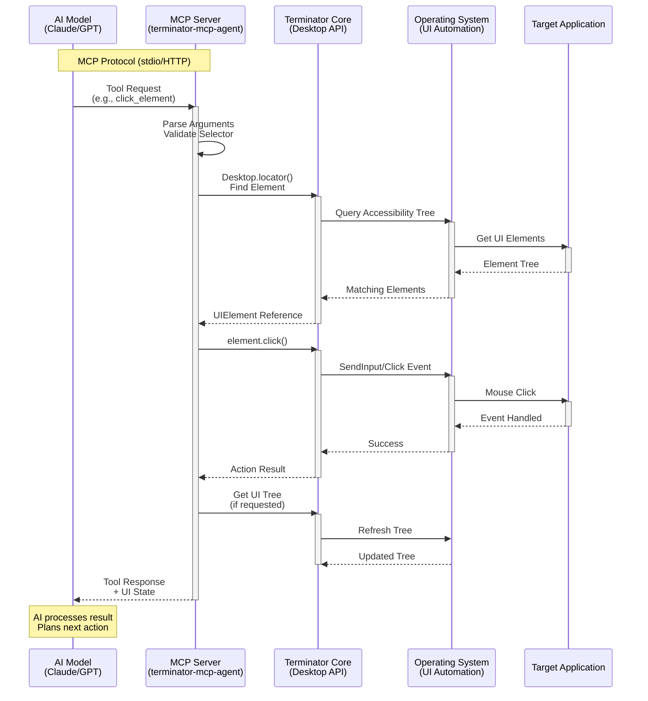
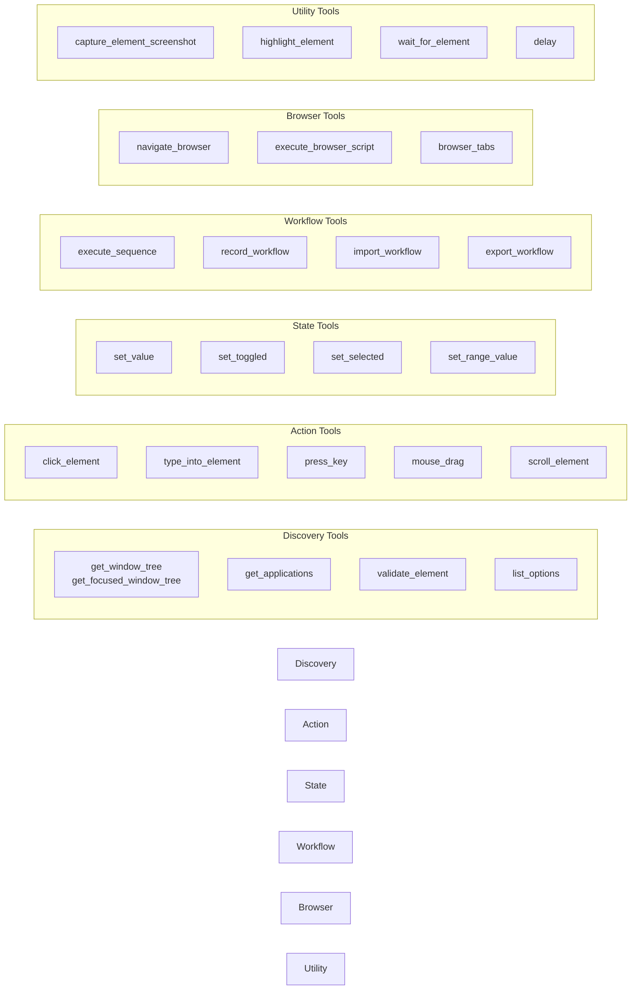
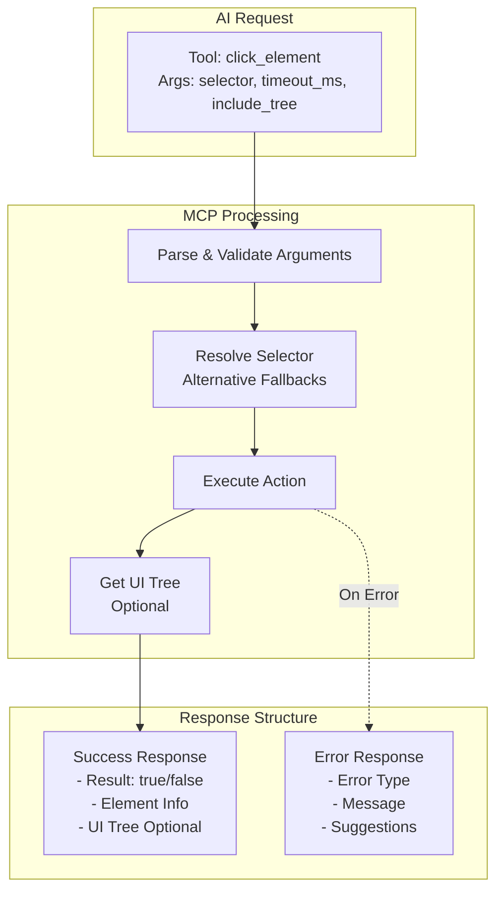
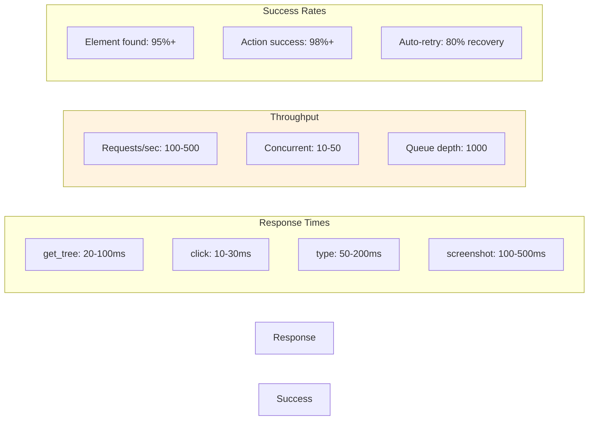
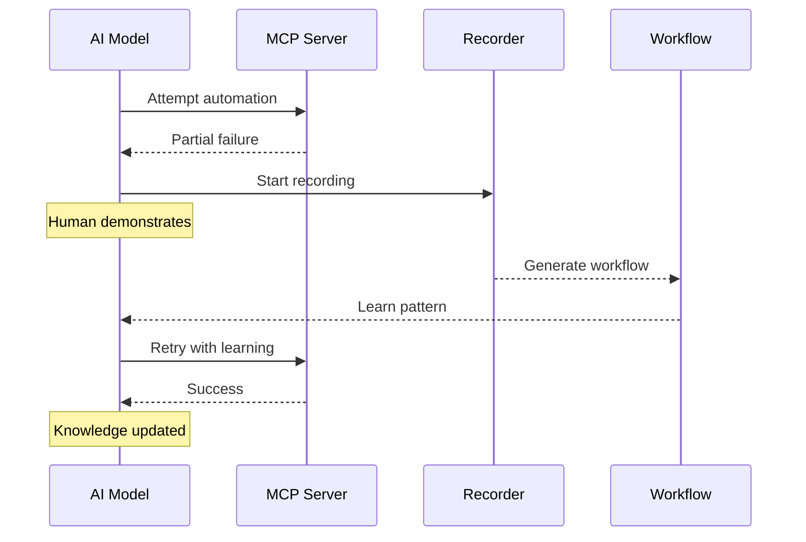

# MCP Integration & AI Workflow

## Overview
This diagram shows how AI models interact with Terminator through the Model Context Protocol (MCP), demonstrating the request flow from AI to desktop automation.



## MCP Tools Categories



## Request/Response Flow



## Real-World Request Examples

```mermaid
graph TB
    subgraph "Login Automation"
        L1[1. get_window_tree]
        L2[2. type_into_element<br/>username field]
        L3[3. type_into_element<br/>password field]
        L4[4. click_element<br/>login button]
        L5[5. wait_for_element<br/>dashboard]
    end

    subgraph "Data Extraction"
        D1[1. navigate_browser<br/>target URL]
        D2[2. execute_browser_script<br/>extract DOM]
        D3[3. parse & process<br/>structured data]
    end

    subgraph "Form Filling"
        F1[1. execute_sequence<br/>load workflow]
        F2[2. parallel fill<br/>multiple fields]
        F3[3. validate_element<br/>check states]
        F4[4. submit & verify]
    end

    L1 --> L2 --> L3 --> L4 --> L5
    D1 --> D2 --> D3
    F1 --> F2 --> F3 --> F4

    style L1 fill:#e3f2fd
    style D1 fill:#fff3e0
    style F1 fill:#e8f5e9
```



## Performance Metrics



## Common Integration Patterns

### 1. Robust Element Selection
```json
{
  "method": "click_element",
  "params": {
    "selector": "role:Button|name:Submit",
    "alternative_selectors": "#submitBtn, text:Submit",
    "fallback_selectors": "nth:0|role:Button",
    "timeout_ms": 5000,
    "retries": 3,
    "include_tree": false
  }
}
```

### 2. Conditional Workflows
```json
{
  "method": "execute_sequence",
  "params": {
    "steps": [
      {
        "tool_name": "validate_element",
        "arguments": {"selector": "role:Dialog"},
        "id": "check_dialog"
      },
      {
        "tool_name": "click_element",
        "arguments": {"selector": "role:Button|name:Close"},
        "if": "env.check_dialog.exists"
      }
    ]
  }
}
```

### 3. Error Recovery
- **Automatic retries** with exponential backoff
- **Fallback selectors** for resilience
- **Alternative actions** (click → invoke → press Enter)
- **State verification** before and after actions

### 4. AI Learning Loop


## Best Practices

1. **Always verify state** before actions
2. **Use multiple selector strategies**
3. **Include error context** in responses
4. **Batch related operations** for efficiency
5. **Cache UI trees** when doing multiple operations
6. **Use highlighting** for debugging
7. **Implement graceful degradation**