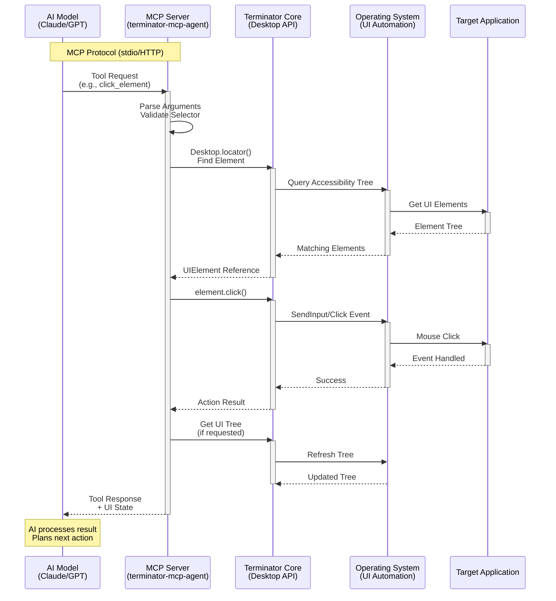
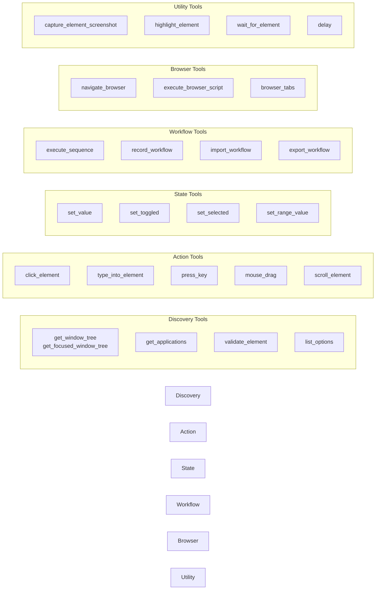
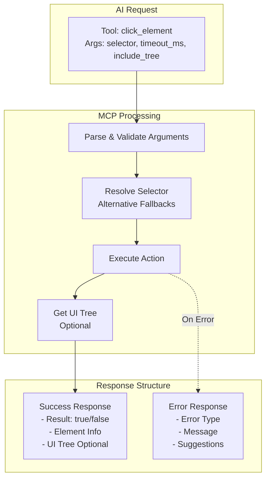

# MCP Integration & AI Workflow

## Overview
This diagram shows how AI models interact with Terminator through the Model Context Protocol (MCP), demonstrating the request flow from AI to desktop automation.

## MCP Tools Categories

## Request/Response Flow

## Key Integration Features

### 1. Selector Strategy
- **Primary**: `role:Button|name:Submit`
- **Alternatives**: Parallel attempts
- **Fallbacks**: Sequential if primary fails
- **ID-based**: `#12345` for precision

### 2. Error Handling
- Element not found → Suggest alternatives
- Timeout → Increase wait or check state
- Disabled element → Check prerequisites
- Focus lost → Activate window first

### 3. Performance Optimizations
- `include_tree: false` by default
- Batch operations in sequences
- Cache element references
- Smart retry logic

### 4. AI-Friendly Design
- Descriptive error messages
- Suggested next actions
- State verification tools
- Visual highlighting for debugging