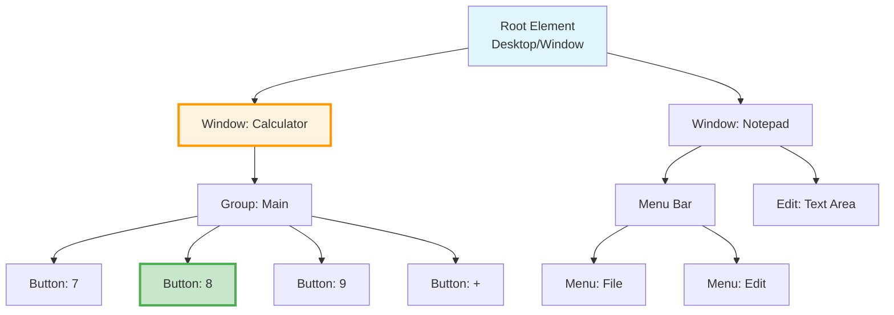

# Element Selection & Locator System

## Overview
This diagram illustrates how Terminator's sophisticated selector system works, from parsing CSS-like syntax to finding elements in the accessibility tree.

```mermaid
flowchart TB
    subgraph "Selector Input"
        SEL[Selector String<br/>'role:Button|name:Submit']
    end

    subgraph "Parser Stage"
        PARSE[Selector Parser]
        TOKENIZE[Tokenize Components]
        BUILD[Build Criteria Tree]
    end

    subgraph "Selector Types"
        ROLE[Role Selector<br/>role:Button]
        NAME[Name Selector<br/>name:Submit]
        ID[ID Selector<br/>#12345]
        NATIVE[Native ID<br/>nativeid:btn_submit]
        POS[Positional<br/>near:, above:, etc.]
    end

    subgraph "Locator Engine"
        LOCATOR[Create Locator]
        FILTER[Apply Filters]
        CHAIN[Handle Chaining<br/>parent >> child]
    end

    subgraph "Tree Traversal"
        WALK[Walk UI Tree]
        MATCH[Match Criteria]
        COLLECT[Collect Results]
    end

    subgraph "Results"
        SINGLE[Single Element]
        MULTI[Multiple Elements]
        NONE[No Match]
    end

    SEL --> PARSE
    PARSE --> TOKENIZE
    TOKENIZE --> BUILD

    BUILD --> ROLE
    BUILD --> NAME
    BUILD --> ID
    BUILD --> NATIVE
    BUILD --> POS

    ROLE --> LOCATOR
    NAME --> LOCATOR
    ID --> LOCATOR
    NATIVE --> LOCATOR
    POS --> LOCATOR

    LOCATOR --> FILTER
    FILTER --> CHAIN

    CHAIN --> WALK
    WALK --> MATCH
    MATCH --> COLLECT

    COLLECT --> SINGLE
    COLLECT --> MULTI
    COLLECT --> NONE

    style SEL fill:#e3f2fd
    style LOCATOR fill:#fff3e0
    style WALK fill:#e8f5e9
```

## Selector Syntax Examples

```mermaid
graph LR
    subgraph "Basic Selectors"
        B1[role:Button]
        B2[name:Submit]
        B3[#12345]
        B4[text:Click Me]
    end

    subgraph "Compound Selectors"
        C1[role:Button|name:Submit]
        C2[role:Edit|text:Email]
        C3[window:Calculator|role:Button]
    end

    subgraph "Chained Selectors"
        CH1[window:App >> role:Form >> role:Button]
        CH2[role:Dialog >> #submitBtn]
    end

    subgraph "Positional Selectors"
        P1[near:Label|role:Edit]
        P2[rightof:Name|role:Edit]
        P3[below:Header|role:Button]
        P4[above:Footer|nth:0]
    end

    style Basic Selectors fill:#e1f5fe
    style Compound Selectors fill:#fff3e0
    style Chained Selectors fill:#e8f5e9
    style Positional Selectors fill:#fce4ec
```

## Selector Resolution Strategy

```mermaid
flowchart LR
    subgraph "Primary Attempt"
        PRIM[Primary Selector<br/>role:Button|name:OK]
    end

    subgraph "Alternative Selectors"
        ALT1[Alternative 1<br/>#okButton]
        ALT2[Alternative 2<br/>text:OK]
        ALT3[Alternative 3<br/>nativeid:btn_ok]
    end

    subgraph "Fallback Chain"
        FB1[Fallback 1<br/>role:Button|nth:0]
        FB2[Fallback 2<br/>near:Cancel|role:Button]
    end

    PRIM -->|Parallel| ALT1
    PRIM -->|Parallel| ALT2
    PRIM -->|Parallel| ALT3

    PRIM -->|If all fail| FB1
    FB1 -->|If fails| FB2

    style PRIM fill:#bbdefb
    style ALT1 fill:#c8e6c9
    style ALT2 fill:#c8e6c9
    style ALT3 fill:#c8e6c9
    style FB1 fill:#ffe0b2
    style FB2 fill:#ffccbc
```

## Tree Traversal Algorithm



## Special Selector Features

### 1. Nth Selector
```
role:Button|nth:2  // Third button (0-indexed)
role:Edit|nth:0    // First edit field
```

### 2. Text Matching
```
text:Submit        // Exact match
text:*Submit*      // Contains
text:/^Submit$/    // Regex
```

### 3. Window Context
```
window:Chrome >> role:Edit    // Edit within Chrome
window:* >> role:Button       // Button in any window
```

### 4. Attribute Matching
```
enabled:true|role:Button      // Only enabled buttons
focused:true|role:Edit        // Currently focused edit
selected:true|role:RadioButton // Selected radio button
```

## Performance Optimizations

1. **ID-based Selection**: Fastest, direct lookup
2. **Role + Name**: Good balance of speed and reliability
3. **Text Search**: Slower, requires content inspection
4. **Positional**: Most expensive, requires geometry calculations

## Error Recovery

When selection fails:
1. Check element exists with `validate_element`
2. Refresh tree with `get_window_tree`
3. Use broader selector (remove constraints)
4. Try numeric ID from tree output
5. Use positional selectors as last resort