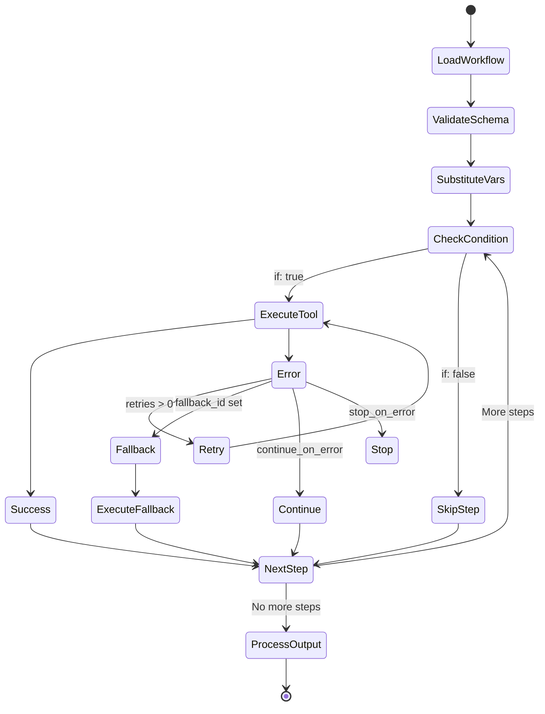
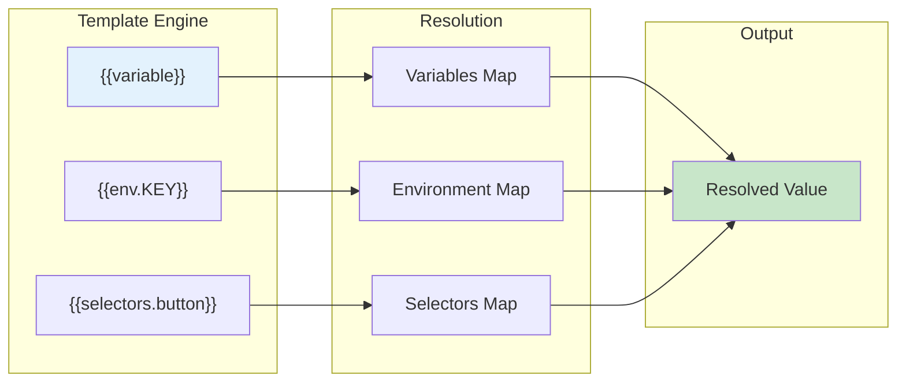
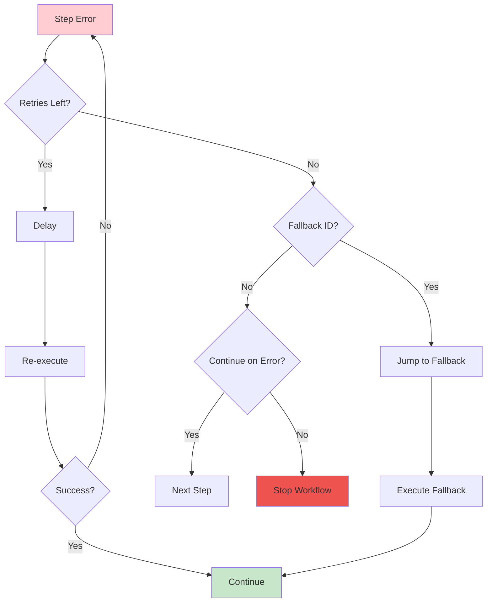
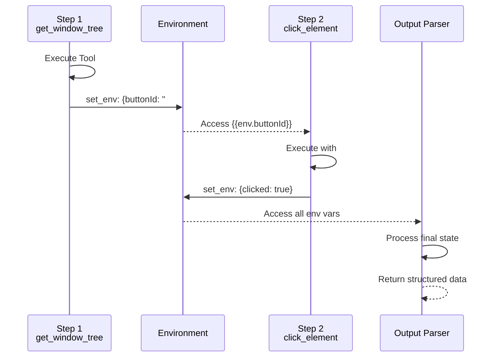

# Workflow Execution Pipeline

## Overview
This diagram shows the complete pipeline from workflow definition to execution, including variable substitution, error handling, and output processing.

```mermaid
flowchart TB
    subgraph "Workflow Definition"
        YAML[YAML/JSON File]
        VARS[Variables Schema]
        SELS[Static Selectors]
        STEPS[Workflow Steps]
    end

    subgraph "Loading Phase"
        LOAD[Load Workflow]
        PARSE[Parse Structure]
        VALIDATE[Validate Schema]
    end

    subgraph "Preparation Phase"
        INPUT[Input Variables]
        MERGE[Merge Defaults]
        SUBSTITUTE[Variable Substitution<br/>{{variable}}]
    end

    subgraph "Execution Engine"
        EXECUTOR[Step Executor]
        EVAL[Evaluate Conditions<br/>if: expressions]
        ACTION[Execute Tool]
        ERROR[Error Handler]
    end

    subgraph "Step Types"
        SINGLE[Single Tool]
        GROUP[Grouped Steps]
        COND[Conditional Step]
        LOOP[Loop/Retry]
    end

    subgraph "State Management"
        ENV[Environment Vars]
        CONTEXT[Execution Context]
        OUTPUTS[Step Outputs]
    end

    subgraph "Output Processing"
        PARSER[Output Parser]
        EXTRACT[Data Extraction]
        FORMAT[Format Results]
    end

    YAML --> LOAD
    VARS --> LOAD
    SELS --> LOAD
    STEPS --> LOAD

    LOAD --> PARSE
    PARSE --> VALIDATE

    VALIDATE --> INPUT
    INPUT --> MERGE
    MERGE --> SUBSTITUTE

    SUBSTITUTE --> EXECUTOR
    EXECUTOR --> EVAL
    EVAL --> ACTION
    ACTION --> ERROR

    EXECUTOR --> SINGLE
    EXECUTOR --> GROUP
    EXECUTOR --> COND
    EXECUTOR --> LOOP

    ACTION --> ENV
    ENV --> CONTEXT
    CONTEXT --> OUTPUTS

    OUTPUTS --> PARSER
    PARSER --> EXTRACT
    EXTRACT --> FORMAT

    ERROR -->|Retry| EXECUTOR
    ERROR -->|Continue| EXECUTOR
    ERROR -->|Fallback| EXECUTOR

    style YAML fill:#e3f2fd
    style EXECUTOR fill:#fff3e0
    style ACTION fill:#c8e6c9
    style ERROR fill:#ffcdd2
```

## Workflow Structure

```yaml
name: "Example Workflow"
description: "Demonstrates workflow features"

# Variable definitions for dynamic inputs
variables:
  username:
    type: string
    label: "Username"
    required: true
  password:
    type: string
    label: "Password"
    required: true
  retryCount:
    type: number
    label: "Retry attempts"
    default: 3

# Static selectors for reuse
selectors:
  loginButton: "role:Button|name:Login"
  usernameField: "role:Edit|name:Username"
  passwordField: "role:Edit|name:Password"

# Workflow steps
steps:
  - id: open_app
    tool_name: open_application
    arguments:
      app_name: "MyApp"

  - id: enter_credentials
    group_name: "Login Process"
    steps:
      - tool_name: type_into_element
        arguments:
          selector: "{{selectors.usernameField}}"
          text_to_type: "{{username}}"

      - tool_name: type_into_element
        arguments:
          selector: "{{selectors.passwordField}}"
          text_to_type: "{{password}}"

  - id: submit_login
    tool_name: click_element
    arguments:
      selector: "{{selectors.loginButton}}"
    retries: "{{retryCount}}"
    fallback_id: manual_login

  - id: manual_login
    tool_name: press_key
    arguments:
      selector: "{{selectors.passwordField}}"
      key: "{Enter}"

# Output processing
output_parser: |
  const tree = result.ui_tree;
  return {
    success: tree.includes("Dashboard"),
    user: "{{username}}"
  };
```

## Step Execution Flow



## Variable Substitution



## Error Handling Strategies



## Data Flow Between Steps



## Performance Features

1. **Parallel Execution**: Groups can run steps in parallel
2. **Smart Caching**: Element references cached within session
3. **Conditional Execution**: Skip unnecessary steps
4. **Early Termination**: Stop on critical errors
5. **Output Streaming**: Results available as they complete