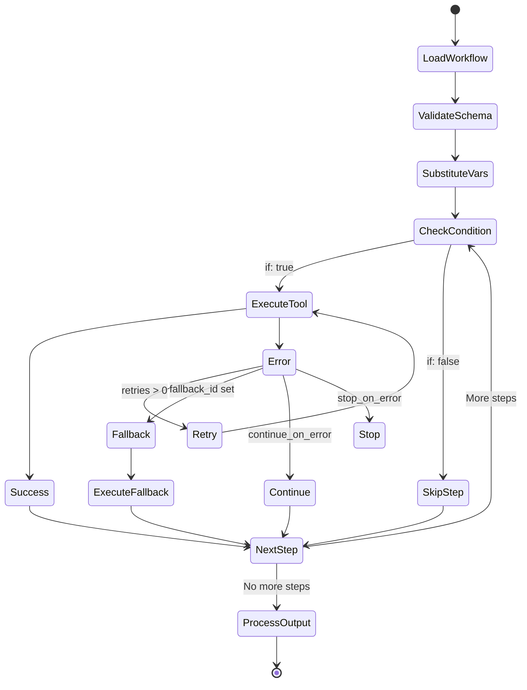
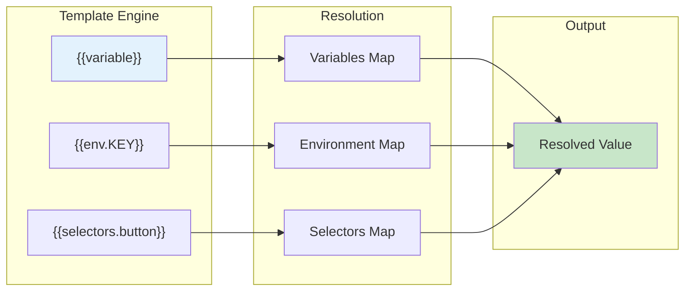
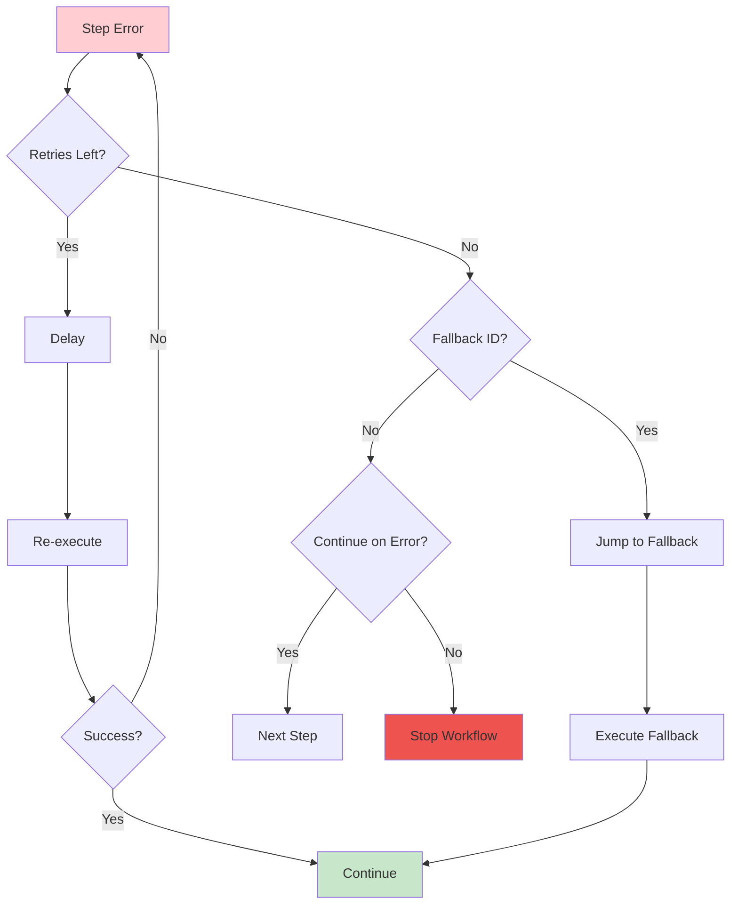
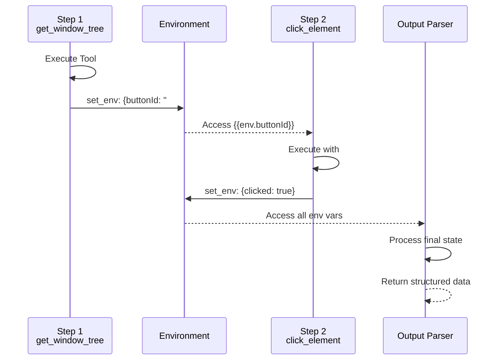
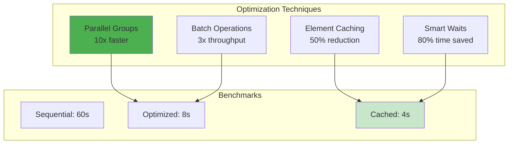
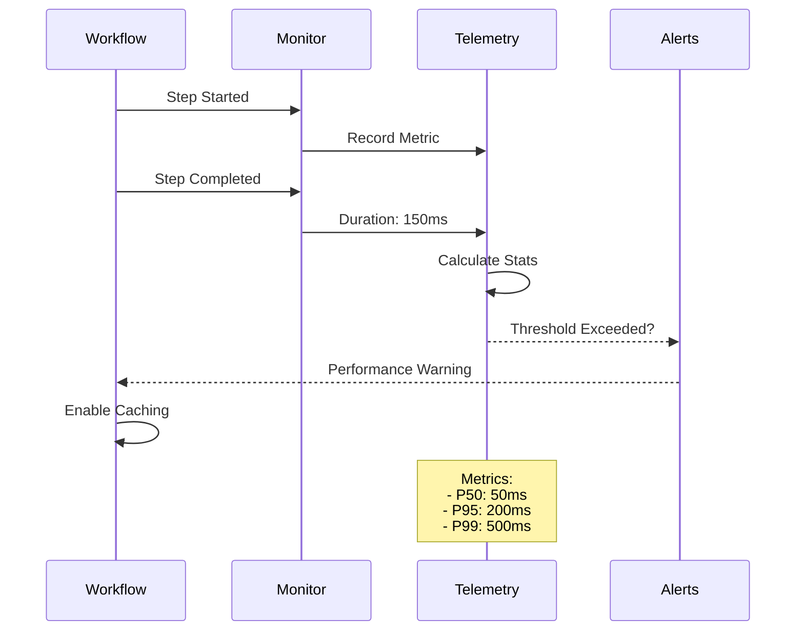

# Workflow Execution Pipeline

## Overview
This diagram shows the complete pipeline from workflow definition to execution, including variable substitution, error handling, and output processing.

```mermaid
flowchart TB
    subgraph "Workflow Definition"
        YAML[YAML/JSON File]
        VARS[Variables Schema]
        SELS[Static Selectors]
        STEPS[Workflow Steps]
    end

    subgraph "Loading Phase"
        LOAD[Load Workflow]
        PARSE[Parse Structure]
        VALIDATE[Validate Schema]
    end

    subgraph "Preparation Phase"
        INPUT[Input Variables]
        MERGE[Merge Defaults]
        SUBSTITUTE[Variable Substitution<br/>{{variable}}]
    end

    subgraph "Execution Engine"
        EXECUTOR[Step Executor]
        EVAL[Evaluate Conditions<br/>if: expressions]
        ACTION[Execute Tool]
        ERROR[Error Handler]
    end

    subgraph "Step Types"
        SINGLE[Single Tool]
        GROUP[Grouped Steps]
        COND[Conditional Step]
        LOOP[Loop/Retry]
    end

    subgraph "State Management"
        ENV[Environment Vars]
        CONTEXT[Execution Context]
        OUTPUTS[Step Outputs]
    end

    subgraph "Output Processing"
        PARSER[Output Parser]
        EXTRACT[Data Extraction]
        FORMAT[Format Results]
    end

    YAML --> LOAD
    VARS --> LOAD
    SELS --> LOAD
    STEPS --> LOAD

    LOAD --> PARSE
    PARSE --> VALIDATE

    VALIDATE --> INPUT
    INPUT --> MERGE
    MERGE --> SUBSTITUTE

    SUBSTITUTE --> EXECUTOR
    EXECUTOR --> EVAL
    EVAL --> ACTION
    ACTION --> ERROR

    EXECUTOR --> SINGLE
    EXECUTOR --> GROUP
    EXECUTOR --> COND
    EXECUTOR --> LOOP

    ACTION --> ENV
    ENV --> CONTEXT
    CONTEXT --> OUTPUTS

    OUTPUTS --> PARSER
    PARSER --> EXTRACT
    EXTRACT --> FORMAT

    ERROR -->|Retry| EXECUTOR
    ERROR -->|Continue| EXECUTOR
    ERROR -->|Fallback| EXECUTOR

    style YAML fill:#e3f2fd
    style EXECUTOR fill:#fff3e0
    style ACTION fill:#c8e6c9
    style ERROR fill:#ffcdd2
```

## Workflow Structure

```yaml
name: "Example Workflow"
description: "Demonstrates workflow features"

# Variable definitions for dynamic inputs
variables:
  username:
    type: string
    label: "Username"
    required: true
  password:
    type: string
    label: "Password"
    required: true
  retryCount:
    type: number
    label: "Retry attempts"
    default: 3

# Static selectors for reuse
selectors:
  loginButton: "role:Button|name:Login"
  usernameField: "role:Edit|name:Username"
  passwordField: "role:Edit|name:Password"

# Workflow steps
steps:
  - id: open_app
    tool_name: open_application
    arguments:
      app_name: "MyApp"

  - id: enter_credentials
    group_name: "Login Process"
    steps:
      - tool_name: type_into_element
        arguments:
          selector: "{{selectors.usernameField}}"
          text_to_type: "{{username}}"

      - tool_name: type_into_element
        arguments:
          selector: "{{selectors.passwordField}}"
          text_to_type: "{{password}}"

  - id: submit_login
    tool_name: click_element
    arguments:
      selector: "{{selectors.loginButton}}"
    retries: "{{retryCount}}"
    fallback_id: manual_login

  - id: manual_login
    tool_name: press_key
    arguments:
      selector: "{{selectors.passwordField}}"
      key: "{Enter}"

# Output processing
output_parser: |
  const tree = result.ui_tree;
  return {
    success: tree.includes("Dashboard"),
    user: "{{username}}"
  };
```

## Step Execution Flow



## Variable Substitution



## Error Handling Strategies



## Data Flow Between Steps



## Real-World Workflow Examples

### E-Commerce Checkout Automation
```yaml
name: "Automated Checkout"
description: "Complete purchase flow"

variables:
  product_url:
    type: string
    label: "Product URL"
  quantity:
    type: number
    default: 1
  coupon_code:
    type: string
    required: false

steps:
  - tool_name: navigate_browser
    arguments:
      url: "{{product_url}}"

  - group_name: "Add to Cart"
    steps:
      - tool_name: set_value
        arguments:
          selector: "role:SpinButton|name:Quantity"
          value: "{{quantity}}"

      - tool_name: click_element
        arguments:
          selector: "role:Button|text:Add to Cart"
          alternative_selectors: "#addToCartButton"

  - tool_name: wait_for_element
    arguments:
      selector: "role:Dialog|name:Cart"
      condition: visible
      timeout_ms: 5000

  - tool_name: click_element
    arguments:
      selector: "role:Button|name:Checkout"
    retries: 3
    fallback_id: alternate_checkout

  - id: alternate_checkout
    tool_name: navigate_browser
    arguments:
      url: "/checkout"
    if: "env.checkout_failed"

  - tool_name: execute_browser_script
    arguments:
      selector: "role:Window"
      script: |
        // Apply coupon if provided
        const coupon = '{{coupon_code}}';
        if (coupon) {
          document.querySelector('#couponCode').value = coupon;
          document.querySelector('#applyCoupon').click();
        }
        return document.querySelector('.total-price').innerText;

output_parser: |
  return {
    success: result.includes('Order Confirmed'),
    total: env.price_extracted,
    order_id: result.match(/Order #(\d+)/)?.[1]
  };
```

### Data Scraping Pipeline
```yaml
name: "Multi-Page Data Extraction"
description: "Scrape paginated results"

variables:
  base_url:
    type: string
  max_pages:
    type: number
    default: 10

steps:
  - tool_name: run_command
    arguments:
      engine: javascript
      run: |
        const results = [];
        let currentPage = 1;

        while (currentPage <= {{max_pages}}) {
          // Navigate to page
          await desktop.navigate(`{{base_url}}?page=${currentPage}`);
          await sleep(2000);

          // Extract data
          const items = await desktop.locator('role:ListItem').all();
          for (const item of items) {
            const name = await item.name();
            const value = await item.value();
            results.push({ name, value, page: currentPage });
          }

          // Check for next page
          const nextButton = await desktop.locator('role:Button|name:Next').first();
          if (!await nextButton.isEnabled()) break;

          currentPage++;
        }

        return { set_env: { scraped_data: JSON.stringify(results) } };

  - tool_name: run_command
    arguments:
      run: |
        echo "{{env.scraped_data}}" > output.json
        echo "Scraped $(echo '{{env.scraped_data}}' | jq length) items"
```

## Performance Optimizations



## Advanced Features

### 1. Dynamic Variable Resolution
```yaml
steps:
  - tool_name: get_window_tree
    id: get_tree

  - tool_name: run_command
    arguments:
      engine: javascript
      run: |
        // Parse tree and extract dynamic values
        const tree = '{{env.get_tree.result}}';
        const buttons = tree.match(/Button:([^,]+)/g);
        return { set_env: {
          button_count: buttons.length,
          first_button: buttons[0]
        }};

  - tool_name: click_element
    arguments:
      selector: "role:Button|name:{{env.first_button}}"
```

### 2. Conditional Branching
```yaml
steps:
  - tool_name: validate_element
    arguments:
      selector: "role:Dialog|name:Error"
    id: check_error
    continue_on_error: true

  - tool_name: execute_sequence
    arguments:
      steps:
        - tool_name: capture_element_screenshot
          arguments:
            selector: "role:Dialog"
        - tool_name: click_element
          arguments:
            selector: "role:Button|name:Retry"
    if: "env.check_error.found == true"
```

### 3. Loop Constructs
```yaml
steps:
  - tool_name: run_command
    arguments:
      engine: javascript
      run: |
        // Process list items until done
        let processed = 0;
        while (true) {
          const items = await desktop.locator('role:ListItem|state:unprocessed').all();
          if (items.length === 0) break;

          for (const item of items) {
            await item.click();
            await desktop.locator('role:Button|name:Process').click();
            await sleep(1000);
            processed++;
          }

          if (processed >= 100) break; // Safety limit
        }

        return { set_env: { total_processed: processed } };
```

## Performance Monitoring



## Debugging Features

1. **Step-by-Step Mode**: Execute one step at a time
2. **Breakpoints**: Pause at specific steps
3. **Variable Inspector**: View all env variables
4. **Screenshot on Error**: Automatic capture
5. **Trace Logging**: Detailed execution logs
6. **Replay Mode**: Re-run failed workflows
7. **Diff Mode**: Compare expected vs actual