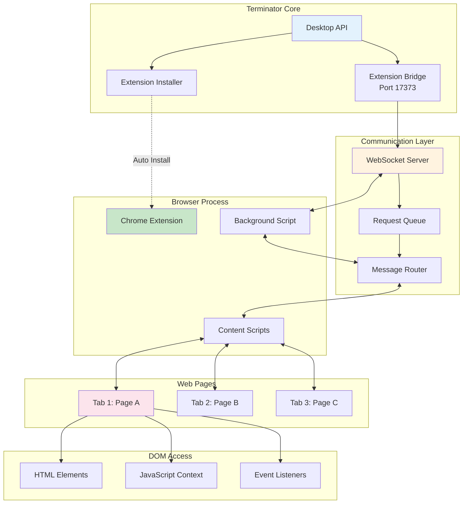
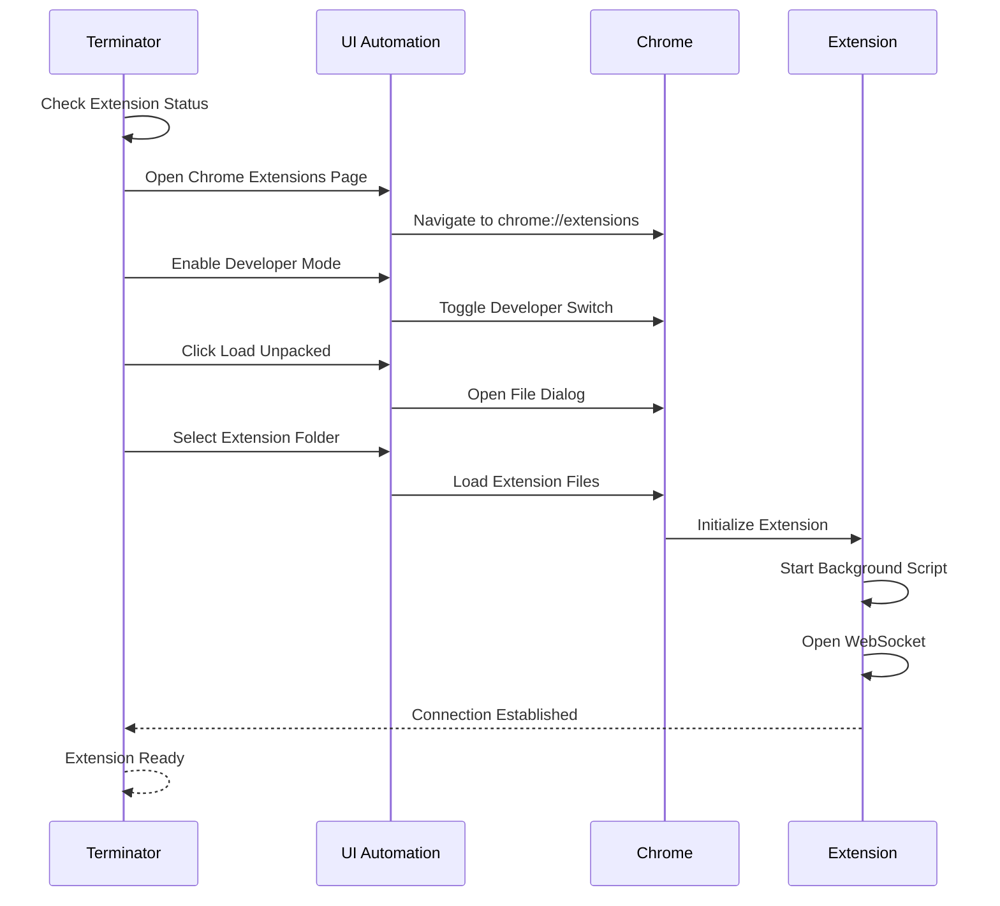
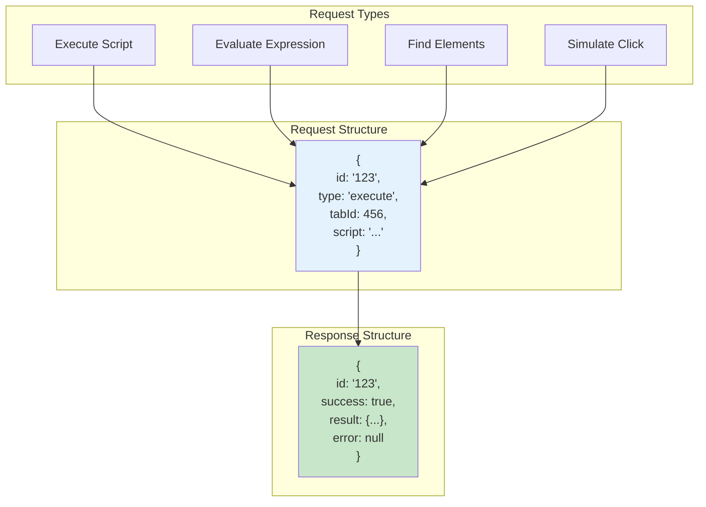
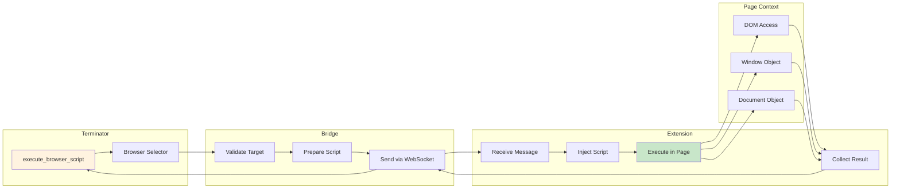
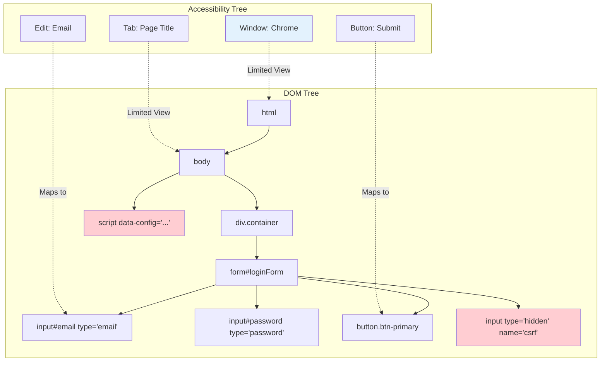
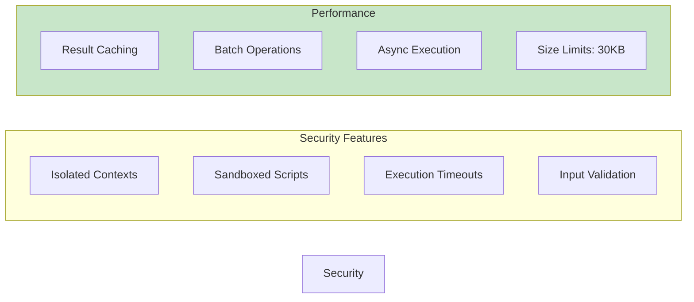

# Browser Extension Architecture

## Overview
This diagram shows how the browser extension integrates with Terminator to provide DOM-level access beyond accessibility APIs.

## Installation Flow

## Message Protocol

## Script Execution Flow

## DOM vs Accessibility Comparison

## Extension Capabilities

### What Extension Can Access
- Full HTML DOM structure
- Hidden form fields
- Data attributes
- JavaScript variables
- CSS computed styles
- Event listeners
- Network requests
- Console output
- Local storage
- Session storage
- Cookies

### What Accessibility API Can't See
- Hidden inputs (type="hidden")
- Data attributes (data-*)
- Script tags content
- CSS pseudo-elements
- Disabled elements (sometimes)
- Shadow DOM content
- iFrames content
- Dynamic JavaScript state

## Security & Performance

## Common Use Cases

1. **Extract Full HTML**: `document.documentElement.outerHTML`
2. **Get Form Data**: Collect all form inputs including hidden
3. **Read Data Attributes**: Access `data-*` attributes
4. **Execute Page Functions**: Call existing page JavaScript
5. **Monitor Network**: Track API calls and responses
6. **Debug Accessibility**: Compare DOM vs accessibility tree