# Cross-Platform Abstraction Layer

## Overview
This diagram illustrates how Terminator abstracts platform-specific accessibility APIs into a unified interface, enabling write-once-run-anywhere automation.

```mermaid
graph TB
    subgraph "Application Layer"
        APP[User Application<br/>Python/JS/Rust]
    end

    subgraph "Terminator Core API"
        DESKTOP[Desktop Struct]
        ELEMENT[UIElement Trait]
        ENGINE[AccessibilityEngine Trait]
        LOCATOR[Locator System]
    end

    subgraph "Platform Abstraction"
        TRAIT[Common Traits<br/>click(), type(), etc.]
        ADAPTER[Platform Adapters]
        MAPPER[Type Mappers]
    end

    subgraph "Windows Implementation"
        WIN_ENGINE[WindowsEngine]
        WIN_ELEM[WindowsElement]
        UIA[UI Automation API]
        COM[COM Objects]
    end

    subgraph "macOS Implementation"
        MAC_ENGINE[MacEngine]
        MAC_ELEM[MacElement]
        AX[AXUIElement]
        CARBON[Carbon/Cocoa]
    end

    subgraph "Linux Implementation"
        LINUX_ENGINE[LinuxEngine]
        LINUX_ELEM[LinuxElement]
        ATSPI[AT-SPI2]
        DBUS[D-Bus]
    end

    APP --> DESKTOP
    DESKTOP --> ELEMENT
    DESKTOP --> ENGINE
    DESKTOP --> LOCATOR

    ENGINE --> TRAIT
    TRAIT --> ADAPTER
    ADAPTER --> MAPPER

    MAPPER --> WIN_ENGINE
    MAPPER --> MAC_ENGINE
    MAPPER --> LINUX_ENGINE

    WIN_ENGINE --> WIN_ELEM
    WIN_ELEM --> UIA
    UIA --> COM

    MAC_ENGINE --> MAC_ELEM
    MAC_ELEM --> AX
    AX --> CARBON

    LINUX_ENGINE --> LINUX_ELEM
    LINUX_ELEM --> ATSPI
    ATSPI --> DBUS

    style APP fill:#e3f2fd
    style DESKTOP fill:#fff3e0
    style TRAIT fill:#c8e6c9
    style WIN_ENGINE fill:#ffecb3
    style MAC_ENGINE fill:#f3e5f5
    style LINUX_ENGINE fill:#ffccbc
```

## Platform API Mapping

```mermaid
graph LR
    subgraph "Terminator API"
        T_CLICK[element.click()]
        T_TYPE[element.type_text()]
        T_FOCUS[element.focus()]
        T_VALUE[element.value()]
    end

    subgraph "Windows"
        W_INVOKE[IUIAutomationInvokePattern]
        W_VALUE[IUIAutomationValuePattern]
        W_FOCUS[SetFocus()]
        W_LEGACY[IUIAutomationLegacyPattern]
    end

    subgraph "macOS"
        M_PRESS[AXPress]
        M_VALUE[AXValue]
        M_FOCUSED[AXFocused]
        M_SETTABLE[AXSettable]
    end

    subgraph "Linux"
        L_ACTION[Action::Click]
        L_TEXT[Text::SetText]
        L_COMPONENT[Component::GrabFocus]
        L_VALUE[Value::SetValue]
    end

    T_CLICK --> W_INVOKE
    T_CLICK --> M_PRESS
    T_CLICK --> L_ACTION

    T_TYPE --> W_VALUE
    T_TYPE --> M_VALUE
    T_TYPE --> L_TEXT

    T_FOCUS --> W_FOCUS
    T_FOCUS --> M_FOCUSED
    T_FOCUS --> L_COMPONENT

    T_VALUE --> W_LEGACY
    T_VALUE --> M_SETTABLE
    T_VALUE --> L_VALUE

    style Terminator API fill:#e3f2fd
    style Windows fill:#ffecb3
    style macOS fill:#f3e5f5
    style Linux fill:#ffccbc
```

## Role Mapping Across Platforms


## Platform Feature Matrix

```mermaid
graph TB
    subgraph "Core Features"
        CF[✅ All Platforms<br/>- Click/Type<br/>- Window Management<br/>- Element Discovery<br/>- Screenshots]
    end

    subgraph "Windows Only"
        WF[🟦 Windows<br/>- Workflow Recording<br/>- Virtual Display<br/>- Legacy Patterns<br/>- UIA Events]
    end

    subgraph "macOS Limited"
        MF[🟩 macOS<br/>- Basic Automation<br/>- Accessibility API<br/>- Limited Permissions]
    end

    subgraph "Linux Varied"
        LF[🟨 Linux<br/>- AT-SPI Support<br/>- X11/Wayland<br/>- DE Dependent]
    end

    CF --> WF
    CF --> MF
    CF --> LF

    style CF fill:#c8e6c9
    style WF fill:#bbdefb
    style MF fill:#c8e6c9
    style LF fill:#fff9c4
```



## Trait Implementation Pattern

```rust
// Simplified trait definition
trait AccessibilityEngine {
    async fn find_elements(&self, criteria: Criteria) -> Vec<Element>;
    async fn get_root(&self) -> Element;
    async fn take_screenshot(&self) -> Image;
}

trait UIElement {
    async fn click(&self) -> Result<()>;
    async fn type_text(&self, text: &str) -> Result<()>;
    async fn get_value(&self) -> Result<String>;
    async fn get_bounds(&self) -> Result<Rect>;
    async fn is_enabled(&self) -> Result<bool>;
}
```


## Platform-Specific Challenges

### Windows
- **COM Threading**: Single-threaded apartment requirements
- **Pattern Availability**: Not all elements support all patterns
- **Permission Model**: Generally permissive

### macOS
- **Security**: Requires accessibility permissions
- **Sandboxing**: App Store restrictions
- **API Limitations**: Fewer automation patterns

### Linux
- **Desktop Diversity**: GNOME/KDE/XFCE differences
- **Wayland**: Limited accessibility support
- **D-Bus**: Complex async messaging

## Error Handling Strategy

