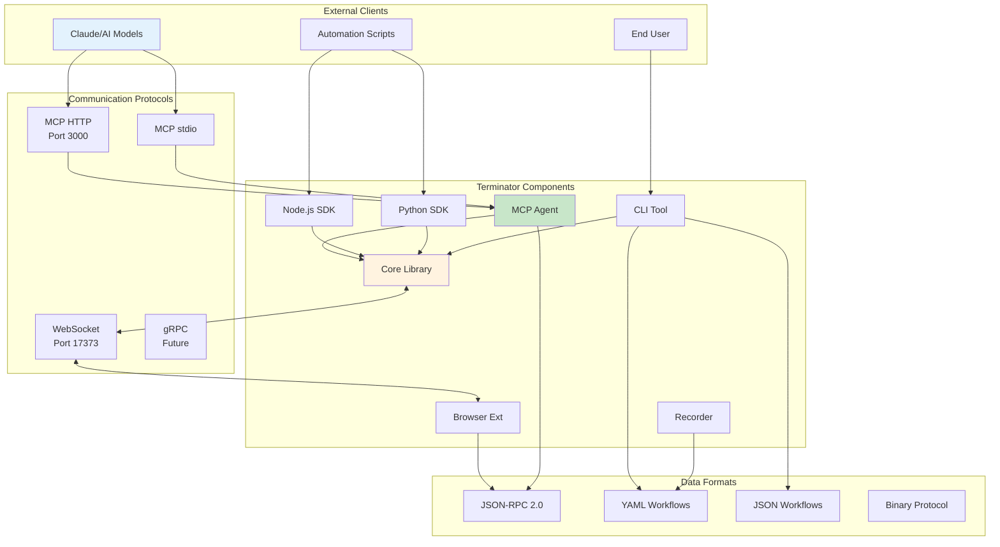
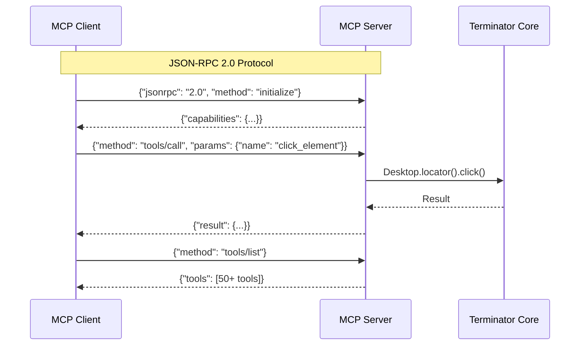
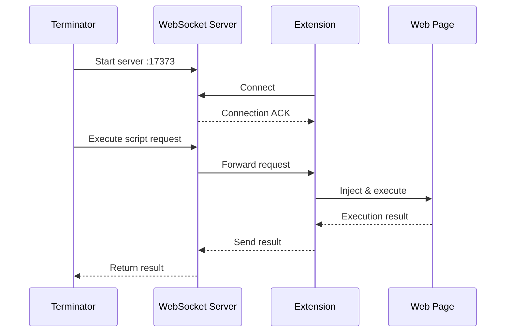
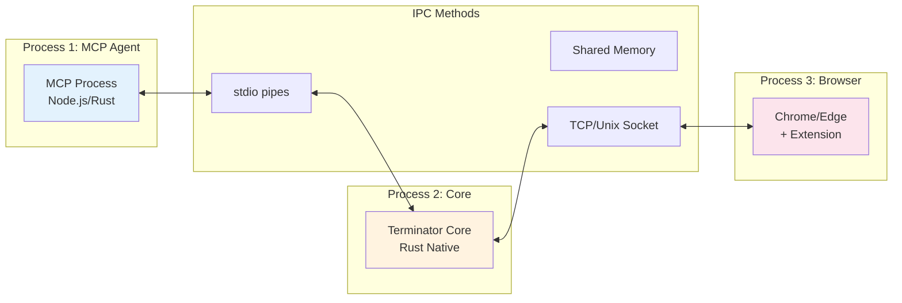
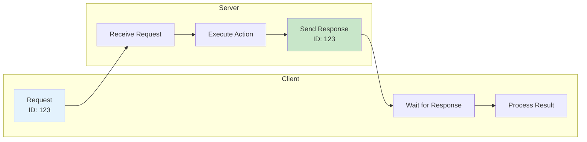
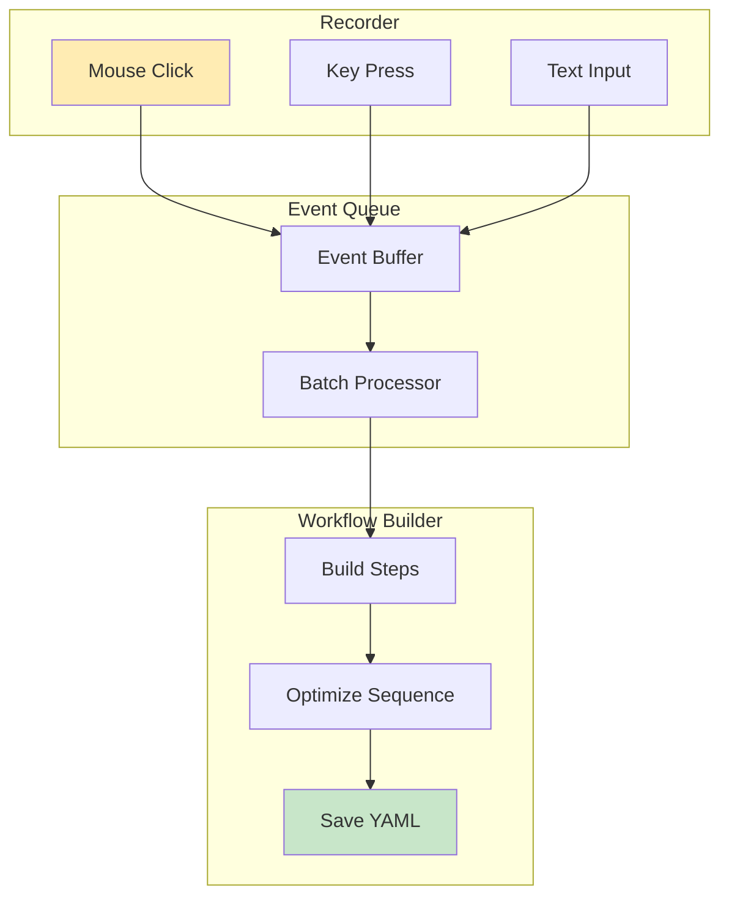
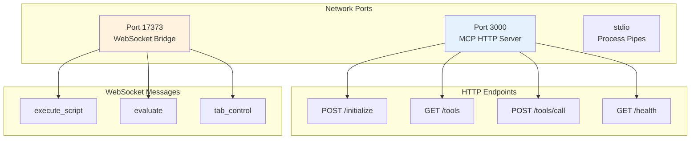
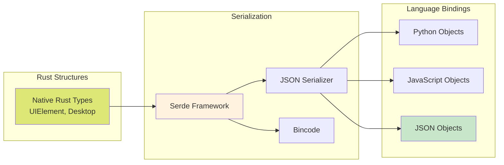
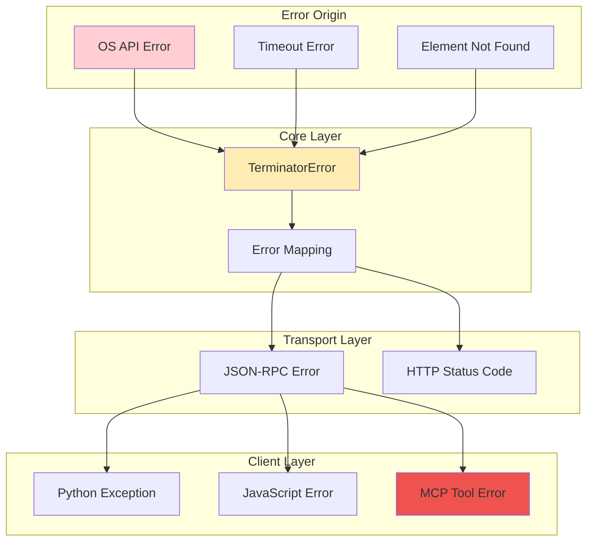

# Component Communication Architecture

## Overview
This diagram shows how different Terminator components communicate with each other through various protocols and data formats.

## Protocol Details

### MCP (Model Context Protocol)

### WebSocket Bridge (Browser Extension)

## Inter-Process Communication

## Message Flow Patterns

### Request-Response Pattern

### Event Streaming Pattern

## Port & Endpoint Map

## Data Serialization

## Error Propagation

## Performance Considerations

1. **Connection Pooling**: Reuse WebSocket connections
2. **Message Batching**: Group multiple operations
3. **Binary Protocol**: Use for high-frequency data
4. **Async Processing**: Non-blocking I/O everywhere
5. **Cache Layer**: Reduce repeated tree queries