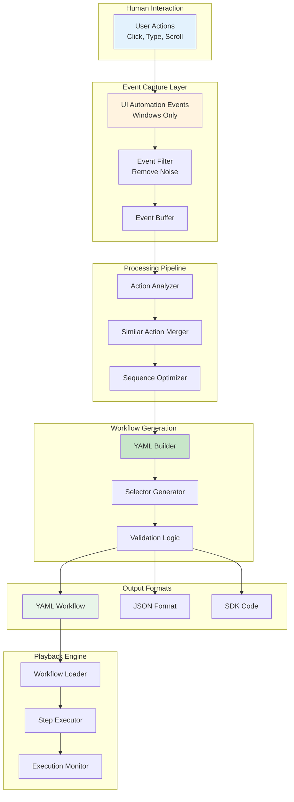
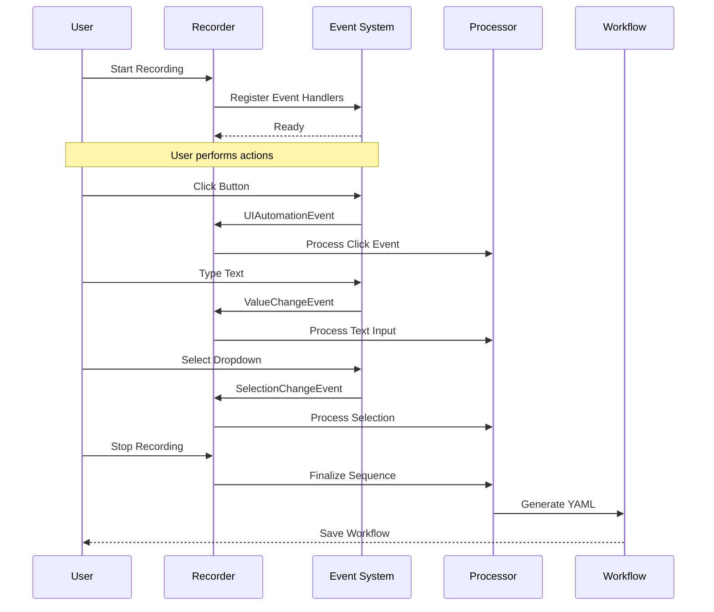
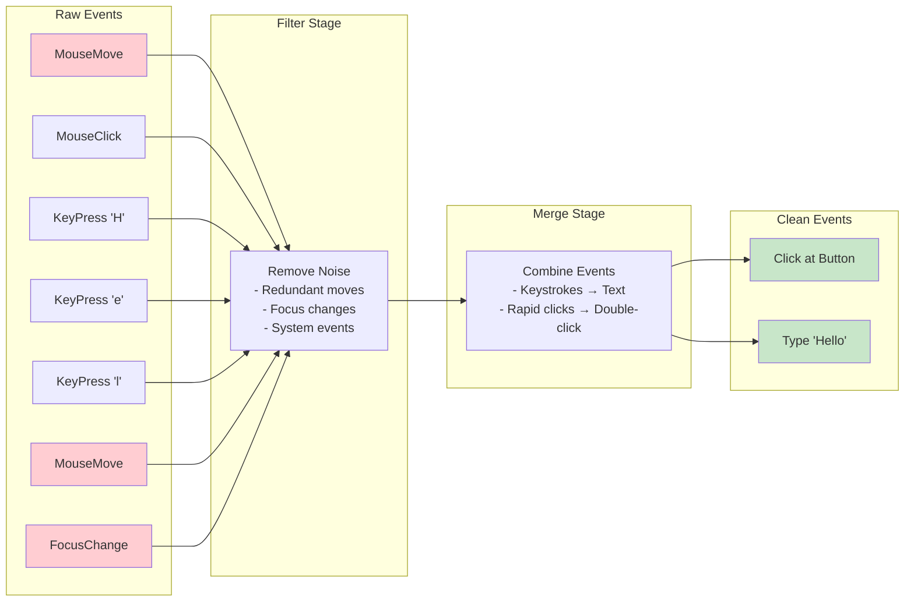
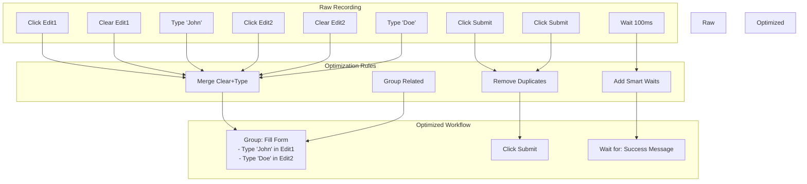
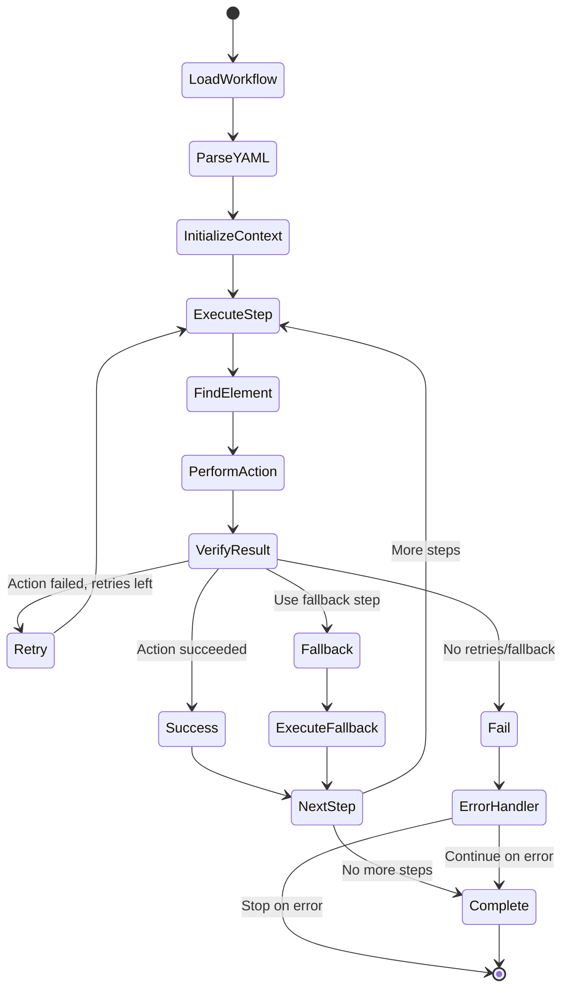

# Recording & Playback Flow

## Overview
This diagram illustrates how Terminator records human interactions and converts them into reusable automation workflows.



## Recording Process



## Event Processing Pipeline



## Selector Generation Strategy

```mermaid
flowchart TB
    subgraph "Element Info"
        ELEM[Clicked Element<br/>- Name: Submit<br/>- Role: Button<br/>- ID: 12345<br/>- Parent: Form]
    end

    subgraph "Selector Generation"
        ANALYZE[Analyze Properties]
        SCORE[Score Uniqueness]
        BUILD[Build Options]
    end

    subgraph "Selector Options"
        OPT1[Primary: role:Button|name:Submit]
        OPT2[Alternative: #12345]
        OPT3[Fallback: window:App >> role:Form >> role:Button]
    end

    subgraph "Final Selector"
        FINAL[selector: role:Button|name:Submit<br/>alternative_selectors: #12345<br/>fallback_selectors: window:App >> role:Button]
    end

    ELEM --> ANALYZE
    ANALYZE --> SCORE
    SCORE --> BUILD

    BUILD --> OPT1
    BUILD --> OPT2
    BUILD --> OPT3

    OPT1 --> FINAL
    OPT2 --> FINAL
    OPT3 --> FINAL

    style ELEM fill:#e3f2fd
    style FINAL fill:#c8e6c9
```

## Workflow Optimization



## Playback Execution



## Recording Features

### Smart Detection
- **Form Recognition**: Groups form field interactions
- **Repetition Detection**: Identifies loops and patterns
- **Wait Inference**: Adds waits based on loading patterns

### Noise Filtering
- Mouse movements without clicks
- Rapid focus changes
- System notifications
- Tooltip hovers

### Action Enhancement
- Converts coordinates to element selectors
- Adds verification steps automatically
- Includes error recovery logic

## Playback Features

### Adaptive Execution
- **Dynamic Waits**: Wait for element states
- **Smart Retries**: Exponential backoff
- **Alternative Paths**: Fallback strategies
- **State Verification**: Ensure expected outcomes

### Error Recovery
```yaml
steps:
  - tool_name: click_element
    arguments:
      selector: "role:Button|name:Submit"
    retries: 3
    continue_on_error: true
    fallback_id: keyboard_submit

  - id: keyboard_submit
    tool_name: press_key
    arguments:
      key: "{Enter}"
```

## Generated Workflow Example

```yaml
name: "Login Flow"
description: "Recorded on 2024-01-15"

steps:
  - tool_name: type_into_element
    arguments:
      selector: "role:Edit|name:Email"
      text_to_type: "user@example.com"
      clear_before_typing: true

  - tool_name: type_into_element
    arguments:
      selector: "role:Edit|name:Password"
      text_to_type: "{{password}}"
      clear_before_typing: true

  - tool_name: click_element
    arguments:
      selector: "role:Button|name:Sign In"
      alternative_selectors: "#loginBtn"

  - tool_name: wait_for_element
    arguments:
      selector: "role:Heading|name:Dashboard"
      condition: "visible"
      timeout_ms: 5000
```