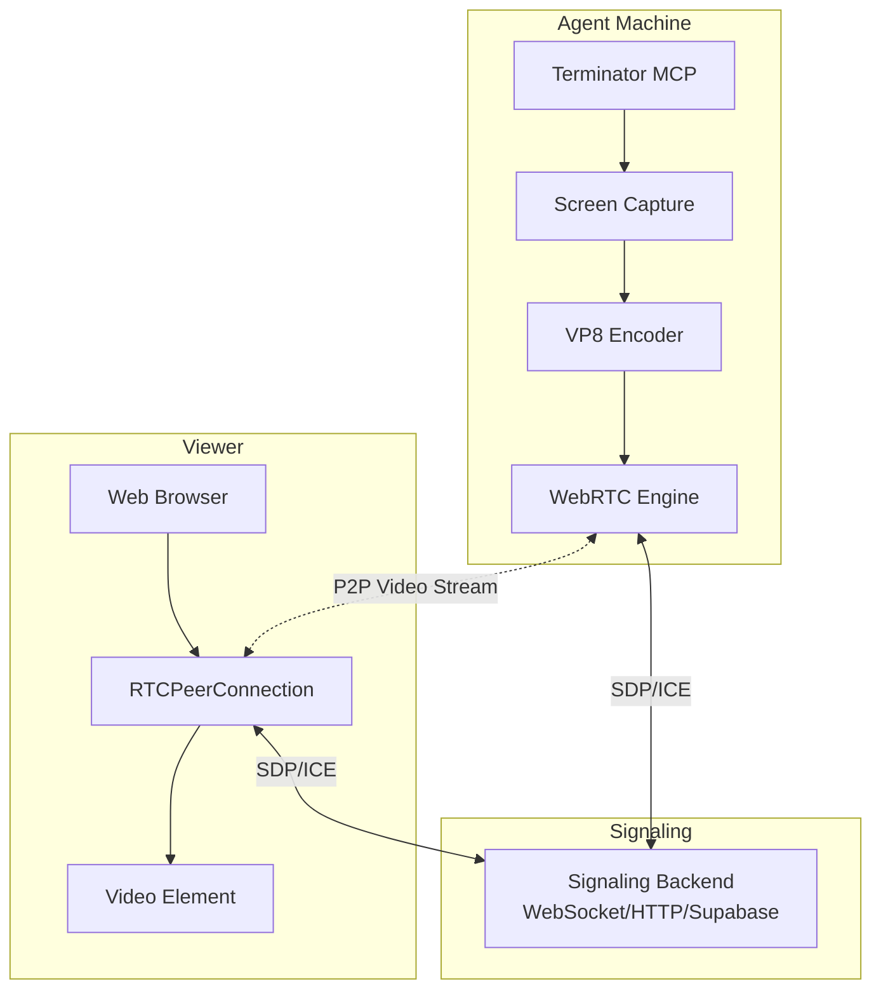

# WebRTC Streaming for Terminator MCP

This document describes the optional WebRTC streaming feature for the Terminator MCP agent, which allows real-time streaming of the desktop to web browsers or other WebRTC-capable clients.

## Overview

The WebRTC streaming feature enables you to:
- Stream the agent's desktop in real-time with sub-second latency
- View agent actions as they happen for debugging and monitoring
- Use any WebRTC-compatible client (web browser, mobile app, etc.)
- Integrate with any signaling backend (WebSocket, HTTP, Supabase, etc.)

## Architecture



## Building with WebRTC Support

The WebRTC feature is optional to keep the base MCP agent lightweight. To enable it:

```bash
cd terminator-mcp-agent
cargo build --features webrtc-streaming
```

## Usage

### 1. Starting a Stream via MCP Tools

The MCP agent exposes three tools when built with WebRTC support:

#### `start_webrtc_stream`
Starts a new WebRTC streaming session.

```json
{
  "tool": "start_webrtc_stream",
  "arguments": {
    "signaling_config": {
      "type": "websocket",
      "url": "wss://your-signaling-server.com",
      "session_id": "unique-session-123"
    },
    "width": 1920,
    "height": 1080,
    "fps": 15,
    "bitrate": 2000000,
    "ice_servers": [
      {
        "urls": ["stun:stun.l.google.com:19302"]
      }
    ]
  }
}
```

#### `stop_webrtc_stream`
Stops the active streaming session.

```json
{
  "tool": "stop_webrtc_stream",
  "arguments": {}
}
```

#### `get_webrtc_stream_status`
Gets the current streaming status.

```json
{
  "tool": "get_webrtc_stream_status",
  "arguments": {}
}
```

### 2. Signaling Configuration

The system supports multiple signaling backends through a plugin architecture:

#### WebSocket Signaling
```json
{
  "type": "websocket",
  "url": "wss://example.com/signaling",
  "session_id": "room-123"
}
```

#### HTTP Polling Signaling
```json
{
  "type": "http",
  "base_url": "https://example.com/api/signaling",
  "session_id": "room-123"
}
```

#### Channel Signaling (for testing)
```json
{
  "type": "channel",
  "session_id": "test-session"
}
```

### 3. Implementing Custom Signaling

You can implement your own signaling backend (e.g., for Supabase) by implementing the `SignalingBackend` trait:

```rust
use async_trait::async_trait;
use terminator_mcp_agent::streaming::{SignalingBackend, SignalingMessage};

pub struct SupabaseSignaling {
    // Your Supabase client
}

#[async_trait]
impl SignalingBackend for SupabaseSignaling {
    async fn send(&self, message: SignalingMessage) -> Result<()> {
        // Send via Supabase Realtime
    }
    
    async fn receive(&mut self) -> Result<SignalingMessage> {
        // Receive from Supabase Realtime
    }
    
    fn session_id(&self) -> &str {
        // Return session/channel ID
    }
}
```

## Web Client Example

Here's a minimal web client to view the stream:

```html
<!DOCTYPE html>
<html>
<head>
    <title>Terminator Stream Viewer</title>
</head>
<body>
    <video id="remoteVideo" autoplay playsinline></video>
    
    <script>
        const pc = new RTCPeerConnection({
            iceServers: [{ urls: 'stun:stun.l.google.com:19302' }]
        });
        
        pc.ontrack = (event) => {
            document.getElementById('remoteVideo').srcObject = event.streams[0];
        };
        
        // Your signaling code here
        // Exchange offer/answer and ICE candidates
    </script>
</body>
</html>
```

## Performance Considerations

- **Default Settings**: 1920x1080 @ 15 FPS, 2 Mbps bitrate
- **CPU Usage**: Encoding is CPU-intensive; consider lowering resolution/FPS on slower machines
- **Network**: P2P connection means minimal server bandwidth usage
- **Latency**: Typically < 500ms with good network conditions

## Security Considerations

1. **Authentication**: Implement proper authentication in your signaling backend
2. **Encryption**: WebRTC provides built-in encryption for media streams
3. **TURN Servers**: For production, use authenticated TURN servers
4. **Session Management**: Implement timeouts and access controls

## Example: Supabase Integration

Here's how you might integrate with Supabase Realtime:

```typescript
// Next.js Dashboard
import { createClient } from '@supabase/supabase-js'

const supabase = createClient(url, key)

// Subscribe to signaling channel
const channel = supabase.channel(`stream:${agentId}`)
  .on('broadcast', { event: 'signaling' }, ({ payload }) => {
    // Handle WebRTC signaling messages
    handleSignalingMessage(payload)
  })
  .subscribe()

// Send signaling messages
await channel.send({
  type: 'broadcast',
  event: 'signaling',
  payload: { type: 'answer', sdp: '...' }
})
```

## Troubleshooting

1. **Stream not starting**: Check ICE server connectivity
2. **No video**: Verify peer connection state in browser console
3. **High latency**: Try reducing resolution/bitrate
4. **Connection fails**: Check firewall/NAT settings, use TURN server

## Future Enhancements

- [ ] H.264 encoding support for better compression
- [ ] Audio streaming support
- [ ] Multiple viewer support
- [ ] Recording capabilities
- [ ] Adaptive bitrate based on network conditions